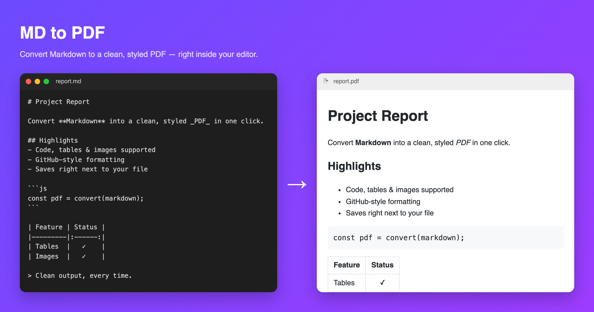

# MD to PDF

Convert any Markdown file to a clean, styled PDF directly from VSCode.

## Features

- Convert the active Markdown editor, or right-click a `.md` file in the Explorer.
- GitHub-style formatting: code blocks, tables, blockquotes, and images.
- A4 output with sensible page margins.
- One-click **Open** of the generated PDF.

## Installation

This extension works in **VS Code, Cursor, VSCodium, and Windsurf**.

### Option 1 — Install the `.vsix` file (works in every editor)

1. **Download the file.** Go to the
   [Releases page](https://github.com/MishGupta/md-to-pdf/releases/latest) and, under
   **Assets**, click `md-to-pdf-0.0.1.vsix` to download it.
2. **Open the Extensions panel.** Click the Extensions icon in the left sidebar
   (four squares), or press `Cmd+Shift+X` (Mac) / `Ctrl+Shift+X` (Windows/Linux).
3. **Install the file.** At the top-right of the Extensions panel, click the `⋯`
   (three dots) button → choose **Install from VSIX…** → select the file you downloaded.
4. You'll see a "Completed installing" message. Done. ✅

> Prefer the terminal? `code --install-extension md-to-pdf-0.0.1.vsix`

### Option 2 — Open VSX (one-click in Cursor / VSCodium / Windsurf)

Search **"MD to PDF"** (publisher `mishka`) in the Extensions panel, or visit the
[Open VSX listing](https://open-vsx.org/extension/mishka/md-to-pdf) and click **Install**.

## How to use

1. Open a `.md` file (or right-click one in the Explorer).
2. Run **Convert Markdown to PDF** from the Command Palette (`Cmd/Ctrl+Shift+P`),
   or the Explorer context menu.
3. The PDF is saved next to the source file with the same name.

## Requirements

On its **first conversion**, the extension downloads a private copy of Chromium
(~150 MB) into its own storage. This happens once; every conversion afterwards is
fast and works offline. An internet connection is required for that first run.

## Known issues

- Remote images referenced by URL may not appear if they are slow or unreachable.

## Release notes

### 0.0.1

Initial release: convert Markdown to PDF from the editor or Explorer.
